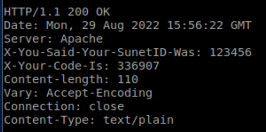
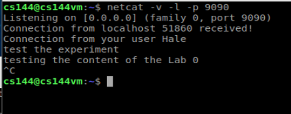
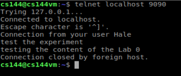

## Lab 0 

### Before the Lab

- It’s a good idea to read the whole document before diving in! 
- the main target is to build a easy and simple TCP protocol.
- The lab documents aren’t “specifications”—meaning they’re not intended to be consumed in a one-way fashion.

#### 2.1 Assignment

```shell
telnet cs144.keithw.org http
GET /lab0/123456 HTTP/1.1
Host: cs144.keithw.org
Connection: close

```




#### 2.2  Assignment

```shell
telnet 148.163.153.234 smtp
HELO mycomputer.stanford.edu
MAIL FROM: U202115980@standford.edu
RCPT TO: cs144grader@gmail.com
DATA
FROM: U202115980@stanford.edu
TO: cs144grader@gmail.com
Subject: Hello from CS144 Lab 0!

QUIT
```

#### 2.3 display

##### server




##### client




because my poor linux orders inplementation, So I have to make conpensation for it 

So the <Cmake> file is coming.